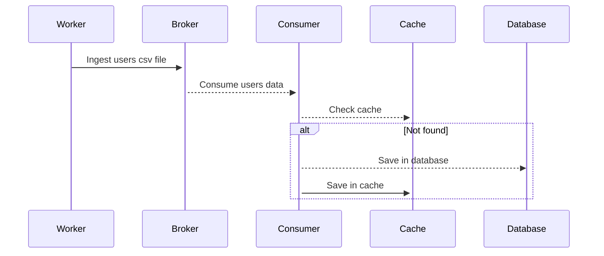
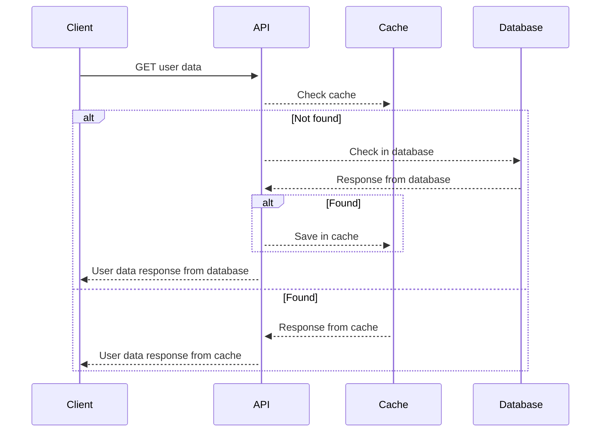

# users

## Description

Project to handle with Users CSV file upload, Users API and integrations stuff

## Requirements

- [Docker](https://docker.com)
- [Go](https://go.dev)
  - [golangci-lint](https://golangci-lint.run/) (optional for linting)

## Instructions

### Environment

### Development

- **Install dependencies**: `make install`
- **Run locally**: `make run`
- **Run with Docker**: `make docker/up`
- **Lint**: `make lint`
- **Tests**: `make test`
- **Show available make commands**: `make help`

## How to Deploy

## Built With

- Golang 1.21
- Docker
- Make

## Application Checklist

- [ ] [Swagger](http://localhost:9000/)
- [ ] [APM]()
- [ ] [CI](https://github.com/julioisaac/users/actions)
- [ ] [CD](https://github.com/julioisaac/users/actions)
- [ ] [Sonar]()
- [ ] [Grafana]()
- [ ] [Logs]()

## Architecture

### Ingestion sequence flow

### Client request sequence flow

