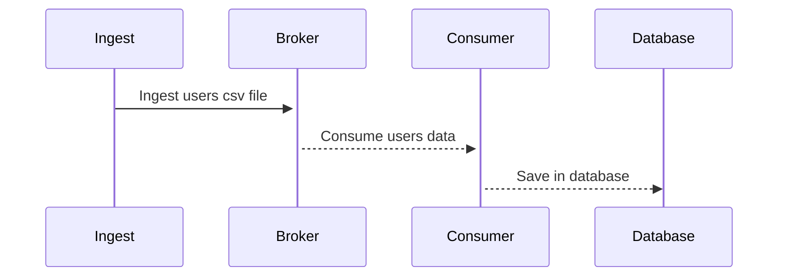
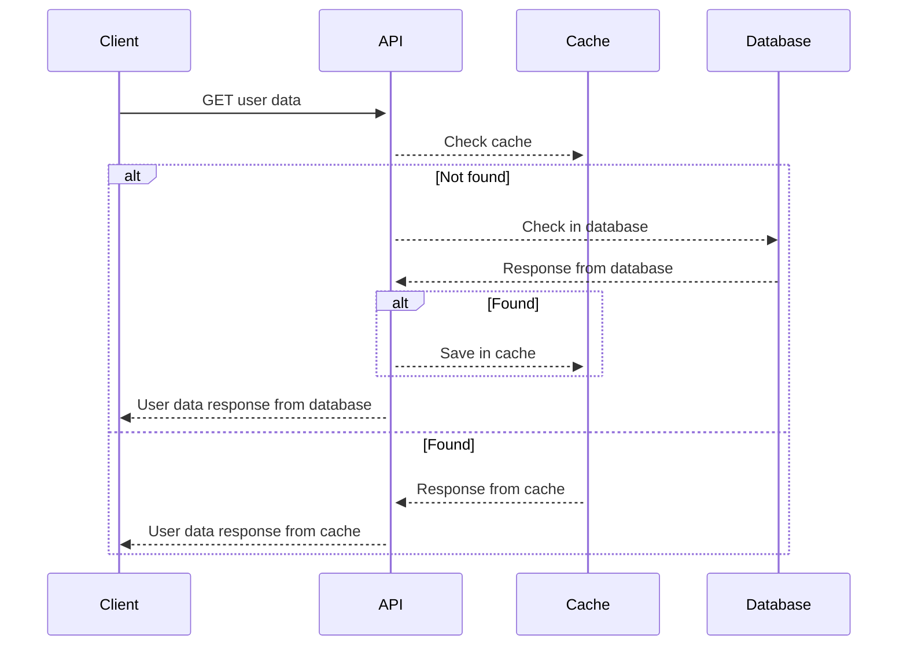

# users

## Description

This code is mean to run multiple applications using `commands`, each application should have their own deploy but they are using the same codebase. For now, the apps are:

- `ingest`: read a user's csv file and publish to rabbitmq
- `consumer`: consumers for events from rabbitmq
- `api`: users

## Requirements

- [Docker](https://docker.com)
- [Go](https://go.dev)
  - [golangci-lint](https://golangci-lint.run/) (optional for linting)

## Instructions

### How to Run

- **Install dependencies**
```bash
make install
```

- **Running local dependencies** if you want to run the application using local dependencies with docker, run the command below
```bash
make docker/up
```

- **Run ingest** in dev mode
```bash
make run/ingest
```

- **Run api** in dev mode
```bash
make run/api
```

## How to Test

### Unit tests
```bash
make unit/test
```

### Integration tests
```bash
make integration/test
```

### Check cover
```bash
make test/coverage
```

### Lint
Just run:
```bash
make lint
```

- **Show available make commands**: `make help`


## Built With

- Golang 1.21
- Docker
- Make

## Application Checklist

- [x] [Swagger](https://localhost/)
- [x] [New Relic](https://one.eu.newrelic.com/)
- [x] [CI](users/.github/workflows/actions)
- [ ] [CD]()
- [ ] [Sonar]()
- [ ] [Grafana]()
- [x] [Logs]()

## Architecture

### Ingestion sequence flow



### Client request sequence flow


